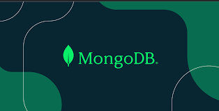
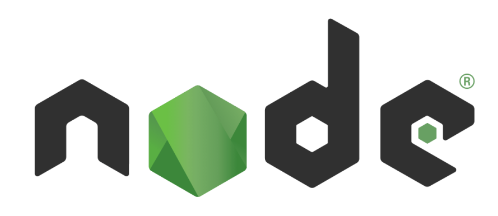
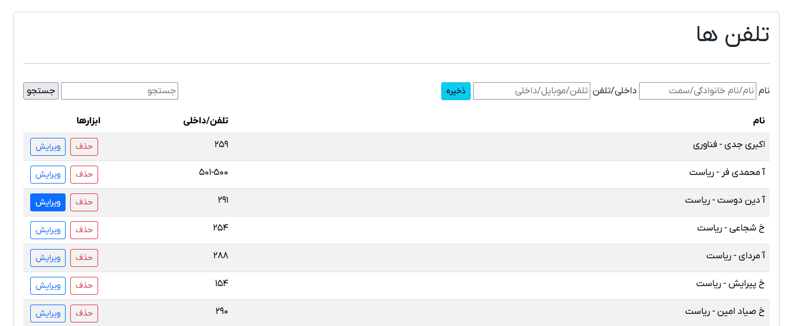

# ExpressJSMongoDB
[]("https://github.com/akbarijedi/ExpressJSMongoDB")
[]("https://github.com/akbarijedi/ExpressJSMongoDB")
[]("https://github.com/akbarijedi/ExpressJSMongoDB")
[]("https://github.com/akbarijedi/ExpressJSMongoDB")


Express.js + MongoDB = Simple Tells Database with Express.js and MongoDB with List + Edit + New + Delete (CRUD)


[]("https://github.com/akbarijedi/ExpressJSMongoDB")

 
## Before start:

  1) [NodeJS](https://nodejs.org/en/download/ "Download Latest Version of NodeJS") Must be Installed.
  2) [MongoDB](https://www.mongodb.com/try/download/community "Download Latest Version of MongoDB") Must be installed.


 
## Dependencies :

    "ejs": "^3.1.9",
    "express": "^4.18.2",
    "mongoose": "^8.0.3"


## Installation

1) Clone the project
2) Go to the project directory and Run the command for installing dependencies :
    ```
    npm install
    ```
3) Edit Server.js file for PORT and MongoDB Server URI, other settings and Routes
4) Run the project and start the SERVER with :
   ```
    node server.js
   ```
5) Open the Browser on localhost:[PORT]
6) Have Fun!
